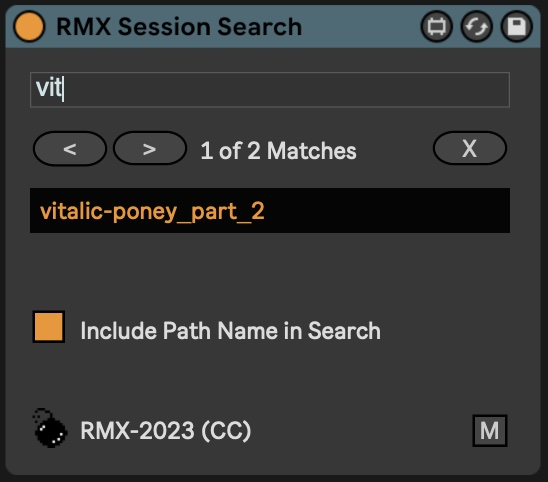

# Ableton Live / Max for Live Devices

This repository contains a bunch of Max for Live utility devices for Ableton Live.

You can also download these devices from https://maxforlive.com/profile/user/radar

## RMX Max Console

Simple button to open the Max Console from Ableton Live.

## RMX Session Search

Utility to search for clip names (and optionally file path names for audio clips) in session view. Covers a missing feature in Ableton and is particularly useful when you have hundreds of clips in your session (such as I have for my DJ sets).

### Notes
- For performance reasons, the utility caches all clip names when the search box is cleared. I.e. when you add / remove or rename clip, make sure you first clear the search box.
- There doesn't seem to be an easy way to highlight a clip without showing its detail view or device chain. In order to keep the search utility focused, it only higlights the scene in which the clip is located. It's a bit of a bummer, but good enough for most cases.
- For quick access to the search utility, map a key or a MIDI note/cc message to the devices title bar *and* to the "M" button. If the key/message is triggered, the device will be shown and the text field will be focused.

### Updates
- 1.0.2
  - Show current match in device

## RMX Tempo Adjust

Utility to increment / decrement tempo by a given amount, using your keyboard or controller buttons.
